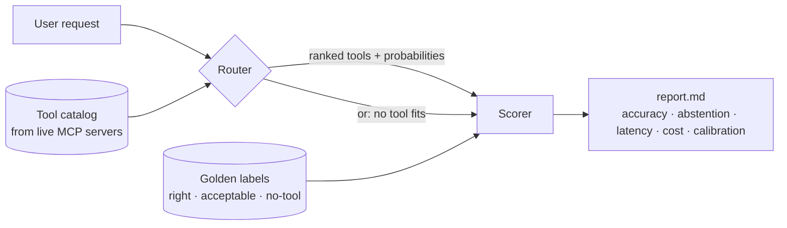

<div align="center">

# 🧭 ToolDiscoveryBench

**How accurately, how fast, and how cheaply can a router pick the right MCP tool?**

*And does it know when no tool fits?*

[](https://www.python.org/)
[](https://docs.astral.sh/uv/)
[](https://docs.astral.sh/ruff/)
[](https://github.com/psf/black)
[](https://mypy-lang.org/)
[](https://modelcontextprotocol.io/)
[](LICENSE)

</div>

---

Agents connected to many MCP servers face hundreds of overlapping tool descriptions. A
**router** in front of the agent narrows them down. ToolDiscoveryBench replays the same
questions, against the same real MCP tool catalogs, through every router, and grades each
first pick against judged gold labels.



## ✨ Highlights

- **Decision models vs LLM agents vs baselines.** TypeSafe **Jev** and the **OpenAI
  Decisions API** return calibrated probabilities; **Strands Agents** (Bedrock, Anthropic,
  OpenAI or open-weight models on **Hugging Face**) picks tools the way a real agent does;
  **BM25** and **embeddings** set the free floor.
- **Real catalogs.** 31 tools pulled live from 10 public, no-auth MCP servers, with
  authenticated servers (GitHub, Microsoft 365) ready to switch on.
- **Judged golden sets.** 1,557 question-catalog pairs written by 9 models from two vendors
  and judged by two cross-vendor judges, including **no-tool** questions where the right
  move is to call nothing.
- **More than accuracy.** Strict and lenient top-1, top-3, right-server rate, abstention,
  p50/p95 latency, tokens, $/1k questions, ECE and Brier calibration.
- **Fair by construction.** Every router sees the identical, seeded catalog for each
  question. Routers without credentials are skipped, never scored as failures.

## 🤖 Routers

| Router | `type` | Modes | What it measures |
|---|---|---|---|
| **Decision models on OpenRouter** | `openrouter` | `flat` · `factored` · `hierarchical` | One `OPENROUTER_API_KEY` for `typesafe/jev-1.13` (or `~typesafe/jev-latest`) and `openai/gpt-6-luna-decisions` via `POST /api/alpha/decisions`. Cost is measured from `usage.cost`. |
| **TypeSafe Jev** | `jev` | `flat` · `factored` · `hierarchical` | A System One decision model: one `choice` over tools, calibrated probabilities, input-only billing. Native API or any `/v1/decisions` gateway (Bifrost, NanoGPT). |
| **OpenAI Decisions API** | `openai_decisions` | `flat` · `factored` · `hierarchical` | `POST /v1/decisions` on `gpt-6-luna` (public beta): typed choice answers with probabilities and confidence. |
| **Strands Agents** | `strands` | `native` · `structured` | An LLM agent with every tool registered as a stub carrying its real MCP schema; records the first tool it calls. Providers: `bedrock`, `anthropic`, `openai`, `huggingface`, `litellm`. |
| **BM25** | `bm25` | | Pure-Python lexical baseline, zero cost. |
| **Embeddings** | `embedding` | | Local `bge-small-en-v1.5` via fastembed, no key. |

The two decision APIs share one router, so they run the same three strategies:

| Mode | Requests | How |
|---|---:|---|
| `flat` | 1 | One choice over every tool (tournament above 255 options). |
| `factored` | 1 | A "which server?" question plus a "which tool on server S?" question per server in **one** request, combined as P(server) × P(tool \| server). |
| `hierarchical` | 2 | Pick servers, then choose among their tools. |

All three add a **"none of these tools"** option, so a decision router can abstain. Any other
router can abstain below a score threshold (`abstain_threshold`).

### Decision models compared

| Model | OpenRouter id | Input $/1M | Output | Context |
|---|---|---:|---|---:|
| TypeSafe Jev | `typesafe/jev-1.13` (pinned) · `~typesafe/jev-latest` | $0.042 | free | 32K |
| GPT-6 Luna Decisions | `openai/gpt-6-luna-decisions` | $0.10 | free | 1.1M |

Both take TypeSafe's native schema (`model`, `state`, `questions` with `choice` criteria) on
OpenRouter, so they run through the same router and modes. The direct TypeSafe and OpenAI
APIs (`jev`, `openai_decisions`) stay available.

## 📚 Datasets

| Suite | Questions | No-tool | Catalog per question | Purpose |
|---|---:|---:|---|---|
| `one_server` | 616 | 67 | tools of 1 connected server (1–5) | choosing within one server |
| `multi_server` | 616 | 67 | tools of 4 connected servers (7–18) | same questions, cross-server confusion |
| `multi_confused` | 325 | 1 | 9–18 tools, confusable by design | the hard subset |
| `claude_v2` | 151 | 0 | sampled at 10 / 30 / 75 / 150 with synthetic distractors | scaling with catalog size |

`datasets_v1` questions were written by Claude Fable, Opus, Sonnet and Haiku plus GPT-5.5,
GPT-5.6 (Sol, Luna, Terra) and GPT-6 Astra, about 70 each. Every label was checked by a GPT
judge and a Claude judge, who agree on 585 of 616 questions. Each record keeps its full
provenance. See [data/golden/README.md](data/golden/README.md).

## 📊 Baseline results

Strict top-1 accuracy on questions that have a right tool:

| Router | one_server | multi_server | multi_confused |
|---|---:|---:|---:|
| BM25 | 71.4% | 61.4% | 54.0% |
| Embeddings (bge-small) | **74.3%** | **65.4%** | **63.0%** |

Neither baseline recognizes no-tool questions: both abstain on 0% of them. A score threshold
on BM25 catches 60% in `one_server` but also wrongly abstains on 18% of answerable questions.
That gap is what calibrated decision models and LLM agents are measured on. Jev, OpenAI
Decisions and Strands results land in the same table as soon as keys are configured.

## 🚀 Quick start

```bash
git clone https://github.com/SarathChandraBellam/ToolDiscoveryBench
cd ToolDiscoveryBench
uv sync --extra strands --extra huggingface --extra embed
cp .env.example .env        # OPENROUTER_API_KEY (Jev + Luna), HF_TOKEN, AWS creds ...

uv run tdb validate                         # golden labels match live tool names?
uv run tdb run --limit 20                   # smoke test, every configured router
uv run tdb run                              # full run -> runs/<timestamp>/report.md
uv run tdb run --routers or-jev-factored,or-luna-factored,embed-bge-small,bm25   # Jev vs Luna
uv run tdb ask "Is AgentCore available in Mumbai?" --router jev-factored
```

| Command | Does |
|---|---|
| `tdb pull` | Snapshot `tools/list` from every server in `configs/servers.yaml`. |
| `tdb validate` | Check every suite's labels and catalogs against the snapshot. |
| `tdb run` | Run suites × routers × catalog sizes; write `results.jsonl`, `summary.csv`, `report.md`. |
| `tdb report RUN_DIR` | Re-render a report. |
| `tdb ask "…"` | Route one question and print the ranking. |

## 🧮 How scoring works

| Metric | Definition |
|---|---|
| **accuracy** | Answerable: the gold tool is picked first. No-tool: the router abstains. |
| **top-1** / **lenient** | Strict top-1 on answerable questions; lenient also accepts tools judged *acceptable*. |
| **top-3**, **MRR**, **server@1** | Shortlist quality, and whether at least the right server was chosen. |
| **abstain ✓** / **false abstain** | Abstention on no-tool questions vs on answerable ones. |
| **p50 / p95 ms**, **calls**, **$/1k q** | Wall-clock per question, upstream calls, cost from configured prices. |
| **ECE**, **Brier**, **conf ✓ / ✗** | Calibration of the top-1 probability (decision models). |

Reports also break accuracy down by tag (`confusable`, `judges_split`, `no_tool`, …) and by
which vendor's model wrote the question. Full definitions: [docs/metrics.md](docs/metrics.md).

## 🗂️ Project layout

```
configs/          servers.yaml (MCP servers) · bench.yaml (suites, routers)
data/
  catalog/        pulled tool catalog + synthetic distractors
  golden/         datasets_v1/ · claude/ · shared/ (labelling inputs) · cross/ · openai/
  raw/            source datasets, unchanged
docs/             architecture · routers · metrics · golden set · development
scripts/          import_datasets.py · make_distractors.py · labeling/
src/tooldiscoverybench/
  core/           data types, config
  mcp/            Streamable-HTTP client (initialize, tools/list, tools/call)
  catalog/        pull · store · per-question sampling
  golden/         load + validate
  routers/
    decisions/    shared decision router (modes, abstention), types, HTTP
    jev/          TypeSafe client + router
    openai_decisions/  OpenAI Decisions client + router
    strands/      provider factory (incl. Hugging Face) + router
    baselines/    bm25 · embedding
  evaluation/     runner · metrics · report
tests/unit/       offline tests: fake HTTP transports and scripted Strands models
```

## 🛠️ Development

```bash
uv run black src tests scripts
uv run ruff check src tests scripts
uv run mypy                 # strict
uv run pytest               # fully offline
```

To add a router, subclass `Router`, implement `route()`, and register it. To add a decision
API, implement a small client with `ask()` and subclass `DecisionRouter`. You get all three
modes and abstention for free. See [docs/routers.md](docs/routers.md).

## 🧭 Why this exists

The project's motivation, hypotheses and scope are in [intent.md](intent.md).

## 📄 License

MIT © Sarath Chandra Bellam
