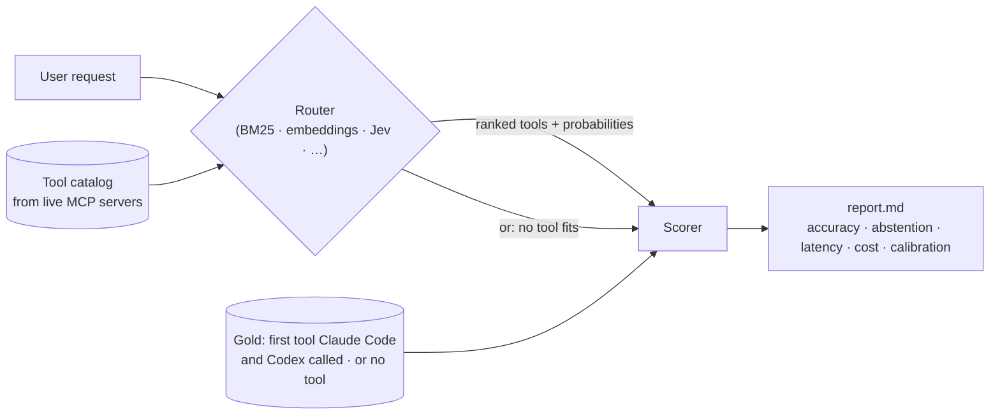

<div align="center">

# 🧭 ToolDiscoveryBench

**Agent harnesses can search large tool catalogs with keyword search such as BM25. Can a small decision model do that search better?**

*And can it say when no tool fits?*

[](https://www.python.org/)
[](https://docs.astral.sh/uv/)
[](https://docs.astral.sh/ruff/)
[](https://github.com/psf/black)
[](https://mypy-lang.org/)
[](https://modelcontextprotocol.io/)
[](LICENSE)

</div>

---

Loading every tool definition from many MCP servers bloats the context and makes tool choice
harder, so harnesses can instead **defer** the definitions and **search** for the few they need.
Tool search is optional, and implementations differ. Anthropic's API offers a
[tool search tool](https://platform.claude.com/docs/en/agents-and-tools/tool-use/tool-search-tool)
in **regex** and **BM25** variants (or your own, for example embeddings) that returns up to 5
tools by default. The
[Claude Agent SDK / Claude Code](https://code.claude.com/docs/en/agent-sdk/tool-search) defers
MCP tool definitions behind tool search by default, without documenting the search method.
ToolDiscoveryBench measures that search step: given a request and a catalog, which tool should
the agent call first, or should it call none?

It replays the same requests, against the same real MCP tool catalogs, through every
**router** (BM25, embeddings, decision models, LLM agents) and grades each first pick
against gold labels taken from what **Claude Code** and **Codex** actually called first
**with the full catalog loaded** (no tool search).

> **Headline (frozen test split, 3 repeats).** TypeSafe **Jev** (flat mode, plain server
> descriptions) matches Claude Code / Codex's first tool on **91.4% / 91.6% / 85.6%** of
> answerable questions (single server / multi-server / look-alike tools), against
> **71.6% / 62.3% / 53.9%** for BM25. It answers in about **225 ms** (median, one network
> round trip) for about **$0.04 per 1,000 queries** (range $0.03–0.06), and it can **abstain**
> when no tool fits. BM25 and embeddings never do.
>
> The proposal is to use Jev as a candidate replacement for the keyword-search step
> (BM25 / regex) that a harness can run instead of loading every tool: keep the harness and
> swap the search. That swap has **not been tested end to end** here. This benchmark
> measures the routing decision in isolation.



## ✨ Highlights

- **Harness-grounded gold labels.** Each original question was run through two real agent
  harnesses, Claude Code (`claude-opus-5-5`) and Codex (`gpt-5.6-sol`), with every tool
  loaded, and the first tool each one called was logged. Top-1 accuracy is agreement with
  those picks, so it measures how well a cheap search step reproduces the choice a frontier
  agent makes when it can see the whole catalog.
- **Real catalogs.** 31 tools pulled live from 10 public, no-auth MCP servers, plus 110
  synthetic distractor tools (flagged) for the catalog-size sweep.
- **Abstention is scored.** About 20% of questions have no right tool. A router gets credit
  only for calling nothing.
- **More than accuracy.** Strict and lenient top-1, top-3/5, right-server rate, abstention,
  p50/p95 latency, tokens, measured $/1k queries, ECE and Brier calibration, with bootstrap
  95% confidence intervals on a frozen held-out test split.
- **Fair by construction.** Every router sees the identical, seeded catalog for each
  question. Routers without credentials are skipped, never scored as failures.

## 📊 Results (frozen test split)

All numbers below come from `results/2026-10-10/` (summary, config and report for every run).
Settings: plain MCP server and tool descriptions (no hand-written hints), frozen test split
(`data/golden/splits/test_qids.txt`), **3 repeats**, top-1 with a **95% bootstrap CI** over
questions. Answerable questions per suite: **162 / 162 / 102**; no-tool questions: 44 / 44 / 29.
Decision models ran through OpenRouter's decisions endpoint, with cost from the provider's
reported `usage.cost`. Latency is wall-clock from one machine in India, so compare it within
a run rather than across runs (a later recheck of Luna flat measured p50 106–110 ms with
identical accuracy).

### Top-1 at a glance

| Router | one_server | multi_server | multi_confused |
|---|---:|---:|---:|
| **Jev flat** | **91.4%** (87.0–95.1) | **91.6%** (87.2–95.5) | 85.6% (79.1–91.8) |
| Jev factored | 91.8% (87.4–95.7) | 89.1% (84.2–93.4) | 87.9% (80.7–93.8) |
| Jev factored + fit question | 90.9% (86.4–94.9) | 88.5% (83.1–93.0) | **88.6%** (81.7–94.1) |
| GPT-6 Luna flat | 88.9% (84.0–93.2) | 87.7% (82.1–92.0) | 76.5% (68.6–84.3) |
| GPT-6 Luna factored | 88.9% (84.0–93.2) | 87.0% (81.5–92.0) | 81.4% (73.5–88.2) |
| Embeddings (bge-small) | 74.1% (66.7–80.9) | 65.4% (57.4–72.8) | 60.8% (51.0–69.6) |
| BM25 | 71.6% (63.6–77.8) | 62.3% (54.3–69.8) | 53.9% (43.1–63.7) |

On look-alike tools (`multi_confused`), retrieval falls 25–32 points behind Jev flat. The
decision models' intervals overlap each other on `one_server` and `multi_server`.

### Full table per suite

"No-tool caught" is the share of no-tool questions where the router abstained; "false
abstain" is the share of answerable ones where it wrongly did. "Refused" is the share of
questions where the backend refused a per-server sub-question (scored as P = 0 for that
server, which can flatter accuracy).

**one_server** (1 connected server, 1–5 tools)

| Router | Top-1 (95% CI) | Top-3 | No-tool caught | False abstain | Refused | $/1k q | p50 ms |
|---|---|---:|---:|---:|---:|---:|---:|
| Jev flat | 91.4 (87.0–95.1) | 99.4 | 90.9 | 0.6 | – | 0.026 | 221 |
| Jev factored | 91.8 (87.4–95.7) | 99.4 | 74.2 | 0.6 | 0.0 | 0.030 | 217 |
| Jev factored + fit question | 90.9 (86.4–94.9) | 98.8 | 97.7 | 1.2 | 0.0 | 0.038 | 156 |
| Luna flat | 88.9 (84.0–93.2) | 99.4 | 95.5 | 0.6 | – | 0.039 | 194 |
| Luna factored | 88.9 (84.0–93.2) | 99.4 | 84.1 | 0.0 | 1.0 | 0.054 | 171 |
| Embeddings | 74.1 (66.7–80.9) | 98.1 | 0.0 | 0.0 | – | free | 5 |
| BM25 | 71.6 (63.6–77.8) | 94.4 | 0.0 | 0.0 | – | free | <1 |

**multi_server** (4 connected servers, 7–18 tools)

| Router | Top-1 (95% CI) | Top-3 | No-tool caught | False abstain | Refused | $/1k q | p50 ms |
|---|---|---:|---:|---:|---:|---:|---:|
| Jev flat | 91.6 (87.2–95.5) | 97.5 | 84.1 | 0.6 | – | 0.052 | 225 |
| Jev factored | 89.1 (84.2–93.4) | 97.5 | 61.4 | 0.6 | 0.0 | 0.070 | 220 |
| Jev factored + fit question | 88.5 (83.1–93.0) | 96.7 | 93.9 | 1.4 | 0.0 | 0.102 | 161 |
| Luna flat | 87.7 (82.1–92.0) | 95.7 | 97.7 | 1.2 | – | 0.092 | 196 |
| Luna factored | 87.0 (81.5–92.0) | 95.1 | 81.8 | 2.5 | 20.9 | 0.150 | 188 |
| Embeddings | 65.4 (57.4–72.8) | 89.5 | 0.0 | 0.0 | – | free | 5 |
| BM25 | 62.3 (54.3–69.8) | 87.7 | 0.0 | 0.0 | – | free | 1 |

**multi_confused** (9–18 tools, confusable by design)

| Router | Top-1 (95% CI) | Top-3 | No-tool caught | False abstain | Refused | $/1k q | p50 ms |
|---|---|---:|---:|---:|---:|---:|---:|
| Jev flat | 85.6 (79.1–91.8) | 97.7 | 80.5 | 0.0 | – | 0.057 | 230 |
| Jev factored | 87.9 (80.7–93.8) | 95.8 | 54.0 | 2.3 | 0.0 | 0.077 | 221 |
| Jev factored + fit question | 88.6 (81.7–94.1) | 98.0 | 86.2 | 0.0 | 0.0 | 0.113 | 163 |
| Luna flat | 76.5 (68.6–84.3) | 98.0 | 96.6 | 0.0 | – | 0.102 | 196 |
| Luna factored | 81.4 (73.5–88.2) | 97.1 | 79.3 | 1.0 | 23.7 | 0.166 | 190 |
| Embeddings | 60.8 (51.0–69.6) | 82.4 | 0.0 | 0.0 | – | free | 4 |
| BM25 | 53.9 (43.1–63.7) | 79.4 | 0.0 | 0.0 | – | free | 1 |

Notes:

- **The fit question** (`abstain_question: true`, PR #5) adds a yes/no "does any listed tool
  fit?" question to the same single factored request. It raises Jev factored's no-tool catches
  from 74 / 61 / 54% to 98 / 94 / 86%, with top-1 holding at 91 / 89 / 89%, at about 1.3–1.5x
  the input tokens. It is opt-in; plain factored is unchanged.
- **Luna factored** has the backend refuse some per-server sub-questions on 21–24% of
  multi-server questions. Treat its multi-server numbers with that in mind.
- **A score threshold doesn't rescue BM25.** `bm25-abstain` (threshold 1.0) catches 43% of
  no-tool questions on `one_server` but also abstains on 19% of answerable ones (top-1 drops
  to 59.9%), and catches almost none on the multi-server suites (4.5% / 3.4%).
- **Reproduction on `main`.** Re-running Jev flat from `main` gave 91.6 / 90.5 / 85.6% top-1,
  inside the intervals above (`results/2026-10-10/test/repro-main`; that run's Luna and Jev
  factored rows hit an out-of-credit error and are not used).

### Shortlist view: is BM25 fine if the harness loads several tools?

A harness that loads the top few search hits (Anthropic's tool search returns up to 5 by
default) only needs the right tool somewhere in the shortlist. Hit rate of the gold tool on the test split (answerable questions):

| Router | multi_server top-3 | multi_server top-5 | multi_confused top-3 | multi_confused top-5 |
|---|---:|---:|---:|---:|
| BM25 | 87.7 | 92.0 | 79.4 | 89.2 |
| Embeddings | 89.5 | 93.8 | 82.4 | 93.1 |
| Jev flat | 97.5 | 98.1 | 97.7 | 99.0 |

Even loading five tools, BM25 misses the right one on 8–11% of these questions, while Jev's
top-3 already holds it about 97.5% of the time. (`one_server` is left out: with 1–5 tools per
catalog, top-5 is trivially 100%.)

### Robustness: dropping questions that could favour a router

`tdb report RUN_DIR --exclude-generators gpt-5.6-sol,claude-opus-5-5,gpt-5.6-luna` (the
default) drops questions written by the two harness models and by GPT-5.6 Luna, which shares
a model line with a router under test. Top-1 on the remaining answerable questions
(112 / 112 / 72):

| Router | one_server | multi_server | multi_confused |
|---|---:|---:|---:|
| Jev flat | 90.2% | 89.9% | 83.3% |
| Jev factored | 91.4% | 89.3% | 85.6% |
| Jev factored + fit question | 89.6% | 87.8% | 85.2% |
| Luna flat | 86.6% | 83.9% | 72.2% |
| Luna factored | 87.5% | 84.8% | 77.8% |
| Embeddings | 69.6% | 61.6% | 54.2% |
| BM25 | 68.8% | 58.0% | 45.8% |

The ordering doesn't change. Abstention on only the **harness-labelled** no-tool questions
(16 per suite in `one_server` / `multi_server`, so wide uncertainty): Jev flat 81 / 75%,
Jev factored + fit question 94 / 92%, Luna flat 94 / 94%, retrieval 0%. Most of the test
split's no-tool questions are the unreviewed synthetic ones (28 of 44, and 28 of 29 in
`multi_confused`), so treat the headline abstention numbers as provisional.

### Catalog size: `claude_v2` at 10 / 30 / 75 / 150 tools

Sampled catalogs (gold + seeded distractors, same-server hard negatives first), test split,
3 repeats, 44 answerable + 11 no-tool questions:

| Tools | Jev flat top-1 (95% CI) | BM25 top-1 (95% CI) | Jev no-tool caught | Jev in-tokens | Jev $/1k q |
|---:|---|---|---:|---:|---:|
| 10 | 95.5% (88.6–100) | 45.5% (31.8–59.1) | 93.9% | 850 | 0.036 |
| 30 | 93.9% (86.4–99.2) | 36.4% (22.7–50.0) | 63.6% | 1,640 | 0.069 |
| 75 | 86.4% (75.8–95.5) | 34.1% (20.5–47.7) | 45.5% | 3,407 | 0.143 |
| 150 | 82.6% (70.5–93.2) | 31.8% (18.2–45.5) | 45.5% | 6,047 | 0.254 |

Accuracy and abstention both fall as the catalog grows, and Jev's cost grows with the prompt
(its context is 32K tokens). The sample is small, so the intervals are wide.

### Escalation and shortlist routers (dev split, preliminary)

These routers (PR #4) were tuned on the **dev split only, 1 repeat**. Their test-split runs
were stopped before finishing and are **not reported**.

**Escalate** (`escalate-jev-sonnet`): Jev flat answers when its decision probability is at
least `escalate_below`; otherwise a frontier LLM (`anthropic/claude-sonnet-5.5` through
OpenRouter, structured output) answers. Replay of one dev run, all three suites pooled
(1,254 questions); Sonnet's cost is estimated as tokens × list price ($2 / $10 per million):

| `escalate_below` | Accuracy | Top-1 | Escalated | $/1k q |
|---:|---:|---:|---:|---:|
| 0 (Jev flat only) | 89.8% | 89.8% | 0.0% | 0.043 |
| 0.50 | 91.1% | 91.3% | 2.6% | 0.18 |
| 0.70 | 92.8% | 95.1% | 12.8% | 0.74 |
| 0.80 | 92.7% | 96.1% | 20.6% | 1.13 |
| **0.85 (default)** | **93.0%** | **96.7%** | **24.1%** | **1.30** |
| 0.95 | 93.2% | 97.6% | 35.5% | 1.83 |

At 0.85, sending the least-confident 24% of questions to the frontier model lifts top-1 from
89.8% to 96.7% at about **30x the cost**. Overall accuracy levels off near 0.70, because the
frontier model abstains less reliably than Jev.

**Shortlist** (`shortlist-bge-jev`): bge-small keeps the top `k` tools, then Jev flat chooses
among them (the "none" option stays). Dev, 1 repeat:

| k | Gold kept by bge-small (multi_server / multi_confused) | Accuracy multi_server | Accuracy multi_confused | $/1k q |
|---:|---|---:|---:|---:|
| no shortlist (Jev flat) | – | 89.6% | 85.4% | 0.052 / 0.057 |
| 8 | 96.9 / 93.7 | 89.6% | 85.4% | 0.039 / 0.040 |
| **10 (default)** | 98.4 / 97.3 | 89.2% | 88.0% | 0.044 / 0.046 |
| 12 | 99.0 / 99.5 | 89.0% | 88.0% | 0.049 / 0.051 |

### Caveats

- **Gold labels come from models, not humans.** "Correct" means "matches what Claude Code
  and Codex called first", cross-checked against the question writer's intended tool. All
  three agree on 585 of 616 original questions. The other 31 were settled by majority and are
  tagged `judges_split` / `relabelled`. Neither harness's pick was reviewed by a person.
- **The no-tool set is partly synthetic.** 80 of the 147 no-tool questions were added
  afterwards by a model (`cursor-bot`), never went through the harnesses, and are tagged
  `needs_human_review`. They make up 28 of 44 test no-tool questions in `one_server` /
  `multi_server`, 28 of 29 in `multi_confused`, and all 39 no-tool questions in `claude_v2`.
- **Model-written requests.** The questions were written by models against real MCP servers,
  not taken from real user traffic. Two of the writers (`claude-opus-5-5`, `gpt-5.6-sol`)
  are also the harness models, and GPT-5.6 Luna wrote about 70 questions while sharing a model
  line with a router under test. See the robustness table above.
- **`claude_v2` is single-vendor.** Its 151 answerable questions were drafted, labelled
  (Haiku, Sonnet, Opus) and judged (Opus) entirely by Claude models, without the harness
  step. Its no-tool questions are the synthetic `cursor-bot` ones.
- **Small test split.** 102–162 answerable questions per suite gives intervals of ±4–8
  points. Differences between the decision models are mostly inside the noise.

## 🤖 Routers

| Router | `type` | Modes | Status | What it measures |
|---|---|---|---|---|
| **Decision models on OpenRouter** | `openrouter` | `flat` · `factored` · `hierarchical` | flat, factored: **benchmarked (test)**; hierarchical: not yet benchmarked | One `OPENROUTER_API_KEY` for `typesafe/jev-1.13` and `openai/gpt-6-luna-decisions` via `POST /api/alpha/decisions`. Cost is measured from `usage.cost`. |
| **BM25** | `bm25` | | **benchmarked (test)** | Pure-Python lexical baseline, zero cost. |
| **Embeddings** | `embedding` | | **benchmarked (test)** | Local `bge-small-en-v1.5` via fastembed, no key. |
| **Escalate (cascade)** | `escalate` | | dev split only (preliminary) | Jev flat answers when its decision probability is ≥ `escalate_below`; otherwise a frontier LLM (Strands via OpenRouter) answers. Tune on dev with `scripts/escalation_curve.py`. |
| **Shortlist** | `shortlist` | | dev split only (preliminary) | A retriever (bge-small or BM25) keeps the top `k` tools, then Jev flat chooses among them. Pick `k` on dev with `scripts/shortlist_recall.py`. |
| **TypeSafe Jev (direct)** | `jev` | `flat` · `factored` · `hierarchical` | supported, not yet benchmarked | Same model through TypeSafe's native API or any `/v1/decisions` gateway (Bifrost, NanoGPT). |
| **OpenAI Decisions API (direct)** | `openai_decisions` | `flat` · `factored` · `hierarchical` | supported, not yet benchmarked | `POST /v1/decisions` on `gpt-6-luna` (public beta). |
| **Strands Agents** | `strands` | `native` · `structured` | supported, not yet benchmarked | An LLM agent with every tool registered as a stub carrying its real MCP schema; records the first tool it calls. Providers: `bedrock`, `anthropic`, `openai`, `huggingface`, `litellm`. |

The decision routers share one implementation, so every backend gets the same strategies:

| Mode | Requests | How |
|---|---:|---|
| `flat` | 1 | One choice over every tool (a tournament above 255 options). |
| `factored` | 1 | A "which server?" question plus a "which tool on server S?" question per server, in **one** request, combined as P(server) × P(tool \| server). With `abstain_question: true`, a yes/no "does any listed tool fit?" question goes in the same request. |
| `hierarchical` | 2 | Pick servers, then choose among their tools. |

All modes add a **"none of these tools"** option (or the fit question), so a decision router can
abstain. Any other router can abstain below a score threshold (`abstain_threshold`).

| Model | OpenRouter id | Input $/1M | Output | Context |
|---|---|---:|---|---:|
| TypeSafe Jev | `typesafe/jev-1.13` (pinned) · `~typesafe/jev-latest` | $0.042 | free | 32K |
| GPT-6 Luna Decisions | `openai/gpt-6-luna-decisions` | $0.10 | free | 1.1M |

## 📚 Datasets

| Suite | Questions (test split) | No-tool (test) | Catalog per question | Purpose |
|---|---:|---:|---|---|
| `one_server` | 696 (206) | 147 (44) | tools of 1 connected server (1–5) | choosing within one server |
| `multi_server` | 696 (206) | 147 (44) | tools of 4 connected servers (7–18) | same questions, cross-server confusion |
| `multi_confused` | 405 (131) | 81 (29) | 9–18 tools, confusable by design | the hard subset |
| `claude_v2` | 190 (55) | 39 (11) | sampled at 10 / 30 / 75 / 150 with synthetic distractors | scaling with catalog size |

The three `datasets_v1` suites are **one set of 696 unique questions** shown with different
catalogs (`multi_confused` is a subset), not 1,797 independent items. Every row carries a
shared `qid`, and `data/golden/questions.jsonl` lists each question once (847 unique across
`datasets_v1` and `claude_v2`). About 30% is frozen as the held-out test split
(250 qids: 206 `datasets_v1` + 44 `claude_v2`).

**How the `datasets_v1` gold was made.** 616 requests against the 10 real MCP servers were
written by nine models, about 70 each (Claude Fable, Opus, Sonnet and Haiku; GPT-5.5, GPT-5.6
Sol, Luna and Terra; GPT-6 Astra), each with an intended tool. Every request was then run
through two agent harnesses, **Claude Code (`claude-opus-5-5`)** and **Codex
(`gpt-5.6-sol`)**, connected to the same servers with **all tools loaded** (no tool search).
The first tool each one called was logged (`meta.judge_picks`).

- The two harness picks and the writer's intended tool all agree on **585 / 616** (`agreement:
  unanimous`). The other 31 were settled by majority and tagged for review. In 23 of them,
  both harnesses chose a different tool than the writer intended, and the harnesses' pick is
  gold (`relabelled`). In 8, the two harnesses disagreed (`judges_split`).
- **67** of the 616 are no-tool requests, and both harnesses called no tool on all 67, which
  leaves **549 answerable, harness-labelled questions**.
- **80** near-miss no-tool questions were added later by `cursor-bot` to bring abstention to
  about 20%. They never went through the harnesses and are tagged `needs_human_review`.

The harness transcripts aren't in this repo. `data/raw/datasets_v1/` holds the logged picks,
and `scripts/import_datasets.py` converts them. `claude_v2` uses a separate pipeline in
`scripts/labeling/`: Claude labellers, live MCP execution of the proposed calls
(`execute_calls.py`), an Opus judge, and an aggregation step. See
[data/golden/README.md](data/golden/README.md) for the split, curation steps and open items.

## 🔁 Reproduce

```bash
git clone https://github.com/SarathChandraBellam/ToolDiscoveryBench
cd ToolDiscoveryBench
uv sync --all-extras
uv run tdb validate
```

**Free (no keys, a few minutes on a laptop):**

```bash
uv run tdb run --split test --repeats 3 --routers bm25,bm25-abstain \
    --suites one_server,multi_server,multi_confused,claude_v2
TDB_EMBED=true uv run tdb run --split test --repeats 3 --routers embed-bge-small \
    --suites one_server,multi_server,multi_confused
```

**Decision models** (`OPENROUTER_API_KEY` in `.env`). Measured cost of the published runs:
about **$0.61** for the five routers below, plus about **$0.08** for the `claude_v2` sweep:

```bash
uv run tdb run --split test --repeats 3 --suites one_server,multi_server,multi_confused \
    --routers or-jev-flat,or-jev-factored,or-jev-factored-fitq,or-luna-flat,or-luna-factored
uv run tdb run --split test --repeats 3 --suites claude_v2 --routers or-jev-flat
```

**Preliminary dev-split routers** (`OPENROUTER_API_KEY`; the escalation run cost about
**$2.30**, mostly the estimated Sonnet calls; each shortlist run costs about $0.03–0.04):

```bash
TDB_ESCALATE_BELOW=0.95 uv run tdb run --routers escalate-jev-sonnet --split dev \
    --suites one_server,multi_server,multi_confused --out runs/dev-escalate
uv run python scripts/escalation_curve.py runs/dev-escalate/results.jsonl --max-rate 0.25
uv run python scripts/shortlist_recall.py --split dev --ks 3,4,5,6,8,10,12   # free
TDB_SHORTLIST_K=10 uv run tdb run --routers shortlist-bge-jev --split dev \
    --suites multi_server,multi_confused
```

Each run writes `runs/<timestamp>/` with `results.jsonl`, `summary.csv` and `report.md`.
Run-to-run differences of a point or two are normal (decision-model sampling, network
latency). To rebuild the combined tables above from several runs, use
`scripts/combine_runs.py` (offline; see `results/2026-10-10/README.md` for the exact command).

| Variable | Needed for |
|---|---|
| `OPENROUTER_API_KEY` | `or-*` routers (Jev, Luna), and the escalate / shortlist routers |
| `TDB_EMBED=true` | turns on `embed-bge-small` (local, free) |
| `TDB_ESCALATE_BELOW`, `TDB_SHORTLIST_K`, `FRONTIER_MODEL_ID` | tuning the preliminary routers |
| `TYPESAFE_API_KEY`, `OPENAI_API_KEY`, `HF_TOKEN`, AWS credentials / `ANTHROPIC_API_KEY` | routers that are supported but not yet benchmarked (`jev`, `openai_decisions`, `strands`) |

## 🚀 Quick start

```bash
git clone https://github.com/SarathChandraBellam/ToolDiscoveryBench
cd ToolDiscoveryBench
uv sync --all-extras
cp .env.example .env        # OPENROUTER_API_KEY (Jev + Luna), HF_TOKEN, AWS creds ...

uv run tdb validate                         # golden labels match live tool names?
uv run tdb run --limit 20                   # smoke test, every configured router
uv run tdb run                              # full run -> runs/<timestamp>/report.md
uv run tdb run --split test                 # only the frozen held-out test split (or `split: test` in the config)
uv run tdb run --split test --repeats 3     # publishable numbers
uv run tdb run --routers or-jev-flat,embed-bge-small,bm25   # Jev vs retrieval
uv run tdb ask "Is AgentCore available in Mumbai?" --router or-jev-flat
```

| Command | Does |
|---|---|
| `tdb pull` | Snapshot `tools/list` from every server in `configs/servers.yaml`. |
| `tdb validate` | Check every suite's labels and catalogs against the snapshot. |
| `tdb run` | Run suites × routers × catalog sizes; write `results.jsonl`, `summary.csv`, `report.md`. |
| `tdb report RUN_DIR` | Re-render a report (`--exclude-generators a,b` sets the robustness table). |
| `tdb ask "…"` | Route one question and print the ranking. |

## 🧮 How scoring works

| Metric | Definition |
|---|---|
| **accuracy** | Answerable: the gold tool is picked first. No-tool: the router abstains. |
| **top-1** / **lenient** | Strict top-1 on answerable questions; lenient also accepts tools judged *acceptable*. |
| **top-3**, **MRR**, **server@1** | Shortlist quality, and whether at least the right server was chosen. |
| **abstain ✓** / **false abstain** | Abstention on no-tool questions vs on answerable ones. |
| **p50 / p95 ms**, **calls**, **$/1k q** | Wall-clock per question, upstream calls, cost from configured prices. |
| **ECE**, **Brier**, **conf ✓ / ✗** | Calibration of the top-1 probability (decision models). |

Reports also break accuracy down by tag (`confusable`, `judges_split`, `no_tool`, …) and by
which vendor's model wrote the question. Full definitions: [docs/metrics.md](docs/metrics.md).

## 🗂️ Project layout

```
configs/          servers.yaml (MCP servers) · bench.yaml (suites, routers)
data/
  catalog/        pulled tool catalog + synthetic distractors
  golden/         datasets_v1/ · claude/ · shared/ (labelling inputs) · cross/ · openai/
  raw/            source datasets, unchanged
docs/             architecture · routers · metrics · golden set · development
scripts/          import_datasets.py · build_benchmark.py · make_distractors.py ·
                  escalation_curve.py · shortlist_recall.py · combine_runs.py · labeling/
results/          dated result snapshots (summaries + reports, no raw jsonl)
src/tooldiscoverybench/
  core/           data types, config
  mcp/            Streamable-HTTP client (initialize, tools/list, tools/call)
  catalog/        pull · store · per-question sampling
  golden/         load + validate
  routers/
    decisions/    shared decision router (modes, abstention), types, HTTP (incl. OpenRouter)
    jev/          TypeSafe client + router
    openai_decisions/  OpenAI Decisions client + router
    strands/      provider factory (incl. Hugging Face) + router
    baselines/    bm25 · embedding
    composite/    escalate (cascade) · shortlist (retrieve, then decide)
  evaluation/     runner · metrics · report
tests/unit/       offline tests: fake HTTP transports and scripted Strands models
```

## 🛠️ Development

```bash
uv run black src tests scripts
uv run ruff check src tests scripts
uv run mypy                 # strict
uv run pytest               # fully offline
```

To add a router, subclass `Router`, implement `route()`, and register it. To add a decision
API, implement a small client with `ask()` and subclass `DecisionRouter`. You get all three
modes and abstention for free. See [docs/routers.md](docs/routers.md).

## 🧭 Why this exists

The project's motivation, hypotheses and scope are in [intent.md](intent.md).

## 📝 Citing

See [CITATION.cff](CITATION.cff) (GitHub shows a "Cite this repository" button). Changes
are listed in [CHANGELOG.md](CHANGELOG.md).

## 📄 License

MIT © Sarath Chandra Bellam
